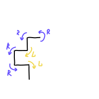

# Drawing Dragon Curve with WebAssembly

This example computes coordinates for [Dragon Curve](https://en.wikipedia.org/wiki/Dragon_curve) in native code and then draws it on canvas in JS.

## Files in each folder dragon-curve-[variant]

- `dragon-curve.c` — source file for native module. It uses memory provided by caller.
- `dragon-curve.wasm` — compiled native module, ready to use.
- `dragon-curve.js` — runtime autogenerated by Emscripten. Contains functions for memory handling (`malloc` and `free`)
- `dragon-curve-wrapper.js` — example of JS wrapper function that hides implementation details and allocates memory
- `index.html` — example of using WASM from browser

### Building with Docker

### Pure llvm

Compile:

```sh
docker run --rm -v $(pwd):$(pwd) -u $(id -u):$(id -g) -w $(pwd) all-wasm \
clang --target=wasm32 -O3 -nostdlib -Wl,--no-entry -Wl,--export-all -o dragon-curve.wasm dragon-curve.c
```

Optimize with wasm-opt

```sh
docker run --rm -v $(pwd):$(pwd) -u $(id -u):$(id -g) -w $(pwd) all-wasm \
wasm-opt -Os dragon-curve.wasm -o dragon-curve-opt.wasm
```

### Emscripten

To build WASM file and JS runtime

```sh
docker run --rm -v $(pwd):$(pwd) -w $(pwd) all-wasm \
emcc dragon-curve.c -o dragon-curve-em.js -s EXPORTED_FUNCTIONS='["_dragonCurve"]' -s EXPORTED_RUNTIME_METHODS='["ccall"]' -s ALLOW_MEMORY_GROWTH=1
```

### Rust example

Create project

```sh
docker run --rm -v $(pwd):$(pwd) -w $(pwd) -e "USER=$(whoami)" all-wasm wasm-pack new rust-example
```

Compile project

```sh
docker run --rm -v $(pwd):$(pwd) -w $(pwd)/rust-example -e "USER=$(whoami)" all-wasm wasm-pack build --release --target web
```

## Running

1.  Run web server in this directory:

    ```sh
    # If you have ruby installed
    ruby -run -e httpd . -p 8000
    # Or if you have python3
    python -m http.server
    ```

2.  Open http://localhost:8000/ in your browser.

## What is dragon curve?

A simple curve that could be generated as a sequence of left/right turns

